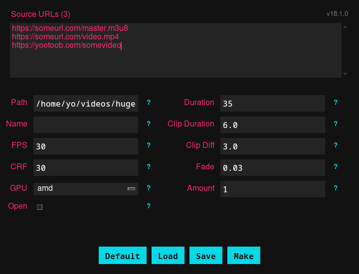

hugegull grabs random sections of variable durations from streaming videos and stitches them together into a single, cohesive highlight video.

It supports local files, YouTube links, Twitch streams, and direct `.m3u8` URLs.

## Installation

### Automatic (Recommended)

The easiest way to install hugegull is globally via `pipx` or `uv`:

```bash
pipx install git+https://github.com/madprops/hugegull --force
```

Or

```bash
uv tool install --python python git+https://github.com/madprops/hugegull.git
```

### Manual

Alternatively, you can clone the repository and set up a shell alias:

```bash
git clone https://github.com/madprops/hugegull ~/code/hugegull
"./install.sh"
alias hgg="~/code/hugegull/run.sh"
```

---

## Usage

You can pass URLs directly to the program. The output name will be randomly generated unless specified.

**Basic Usage:**
```bash
hugegull "https://something.m3u8"
```

**Multiple Sources:**
```bash
hugegull "https://something.m3u8" "https://otherthing.m3u8"
# OR
hugegull --url "https://something.m3u8" --url "https://otherthing.m3u8"
```

**With Options:**
```bash
hugegull "https://something.m3u8" --name "nice video" --open
```

**Using Environment Variables:**
```bash
export HUGE_URL="https://something.m3u8" "https://otherthing.m3u8"
export HUGE_NAME="nice video"
hugegull
```

---

## Configuration

hugegull can be configured via Command Line Arguments, Environment Variables, or a TOML configuration file.

The default configuration file is located at `~/.config/hugegull/config.toml`. It is created automatically on your first run.

### Configuration File Example
```toml
path = "/home/memphis/toilet"
duration = 35.0
fps = 30
crf = 30
gpu = "amd"
amount = 1
fade = 0.03
```

### Options Reference

Run `hugegull --help`

---

## Shell Integration

To make running hugegull even faster, you can add these snippets to your shell configuration.

### Fish Shell (`~/.config/fish/config.fish`)

```fish
alias hgg="hugegull"
# Or if installed manually: alias hgg="python ~/code/hugegull/main.py"

function egull
  set -x HUGE_URL $argv[1]
end
```

Then you can do:
```fish
egull "https://something.m3u8" "https://otherthing.m3u8"
hgg
```

---

## GUI

There is a graphical user interface that can be spawned with `--gui`.



The GUI has some tricks, like clicking `URL List` to paste urls.

Middle clicking to restore defaults.

Middle clicking the `-` and `+` buttons to dec or inc `0.5` instead of `1`.